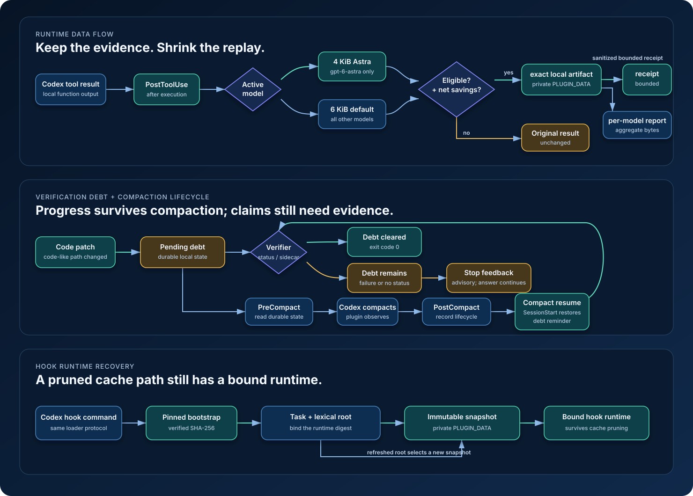

# SoL Codex

SoL Codex is a local Codex Desktop plugin that preserves exact large tool output on disk, returns a bounded redacted receipt to the model, and tracks whether code changes have been verified. It is an independent, SoL-inspired implementation for Codex hooks.

The plugin changes model-visible tool output and, in `bypassPermissions` mode, wraps recognized verifier commands to capture their exit status. It does not select a model, initiate compaction, call another model, or claim changes to token use, billing, quota, or answer quality.

[Русская версия](README.ru.md) · [Installation](docs/installation.md) · [Security](docs/security.md) · [Troubleshooting](docs/troubleshooting.md)



## Quick start

Prerequisites: Codex with plugin and hooks support, Python 3.9 or newer, and macOS or Linux. The hook contract was validated against Codex `0.155.0-alpha.9.2`.

```bash
codex plugin marketplace add DmitrL-dev/SoLCodex
codex plugin add sol-codex@sol-codex
```

Open `/hooks`, review the resolved commands, and trust the plugin when Codex asks. Start a new task so the lifecycle hooks are loaded. See [installation](docs/installation.md) for updates, removal, and cache details.

## What it does

- `PostToolUse` watches shell and patch results. Eligible output larger than 12 KiB is written exactly under `PLUGIN_DATA`; `gpt-6-astra` uses a 4 KiB threshold.
- The model receives a bounded receipt with status (or `unknown`), hashes, diagnostic lines, and a small preview. Receipt redaction is best effort; the exact local artifact is not redacted.
- Successful code patches create verification debt. A recognized verifier clears it only when its matching `PreToolUse` ran after the latest code patch and a structured exit code or private status sidecar proves exit code zero.
- `PreCompact`, `PostCompact`, and `SessionStart` keep the debt reminder across Codex compaction. `Stop` warns about pending or failed verification without blocking the final answer; the agent must report checks accurately.
- Aggregate source, receipt, and saved byte counts are recorded per model. These byte counts are not token, cost, quota, latency, or quality measurements.

Plain-string `PostToolUse` results can be packed if the hook receives enough bytes, but their receipt says `exit_code=unknown` unless a verifier sidecar supplies status. `PreToolUse` records the current code-change generation for recognized verifiers. In `bypassPermissions` mode only, it also wraps recognized Bash verifiers to capture status; in approval-capable modes, it does not rewrite or auto-approve commands. Structured responses can supply status directly. In code-mode, host-side truncation before `PostToolUse` limits what the plugin can archive or count.

The full flow is documented in [architecture](docs/architecture.md).

## Configuration

Set environment variables before launching Codex:

```bash
export SOL_CODEX_ASTRA_PACK_THRESHOLD_BYTES=4096
export SOL_CODEX_PACK_THRESHOLD_BYTES=12288
```

`SOL_CODEX_ASTRA_PACK_THRESHOLD_BYTES` applies only when the current model is `gpt-6-astra`. `SOL_CODEX_PACK_THRESHOLD_BYTES` is a global override and takes precedence for every model. Values are bytes and are clamped to at least 256. The plugin does not select a model; the Astra profile is active only when Codex already reports `gpt-6-astra` as the current model.

## Reports

Run the hook script with the same `PLUGIN_DATA` directory shown by the installed hook environment:

```bash
PLUGIN_DATA=/path/to/your/sol-codex-data \
  python3 /path/to/installed/sol-codex/scripts/sol_hook.py --report
```

The JSON report contains aggregate byte counters only. Marketplace names affect installed cache and data paths, so copy the resolved locations from `/hooks` rather than guessing them. The [measurement methodology](docs/savings.md) explains the formulas and limitations.

In a [local historical snapshot](docs/savings.md), 355 packed events contained 8,158,596 source bytes and returned 735,540 receipt bytes: 7,423,056 fewer model-visible serialized bytes (90.98%) for those events. This is local byte accounting, not a measured saving in tokens, money, quota, or time, and it does not establish unchanged task quality. The snapshot predates plain-string packing, includes only outputs selected by the active byte threshold and net-savings guard, and has 338 legacy events without model attribution. SoL-Pi's results do not apply to this plugin.

## Security and limits

Exact local artifacts can contain credentials, source code, or personal data. They use private filesystem modes and are never uploaded by this plugin, but anyone with access to the account or storage may still read them. Review [docs/security.md](docs/security.md) before enabling hooks on sensitive work.

Windows is unsupported because the implementation requires Python's `fcntl`. Hook failures are fail-open so a plugin error does not take down Codex; this also means verification enforcement is advisory when the hook is degraded. See [docs/troubleshooting.md](docs/troubleshooting.md) for hook conflicts, trust prompts, cache versions, and missing data paths.

## Remove

```bash
codex plugin remove sol-codex@sol-codex
```

Removing the plugin does not delete local artifacts. Remove the confirmed `PLUGIN_DATA` directory separately. Optional marketplace removal and safe cleanup are covered in [installation](docs/installation.md).

## Upstream and license

The design is conceptually inspired by [NVlabs/SoL-Pi](https://github.com/NVlabs/SoL-Pi), but this repository is an independent Codex-specific implementation with no copied SoL-Pi code, no fork lineage, and no endorsement by NVIDIA or OpenAI. See [upstream attribution](docs/upstream.md).

SoL Codex is licensed under the [MIT License](LICENSE).
