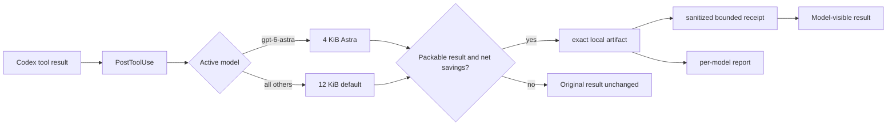
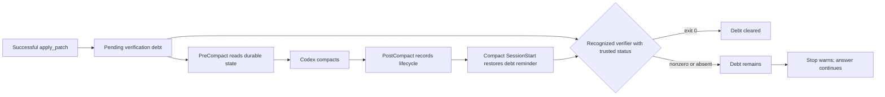

# Architecture

SoL Codex is a local Codex hook plugin. It observes supported lifecycle events, stores eligible large tool output under the plugin's writable data directory, and returns a smaller evidence-bearing receipt when doing so reduces model-visible bytes.

The editable diagram source is [`assets/architecture.mmd`](../assets/architecture.mmd). The README-ready render is [`assets/architecture.svg`](../assets/architecture.svg).

## Runtime data flow

`PostToolUse` runs after the tool has completed. It cannot undo file writes, commands, or other side effects. A shell result is packable when it is a plain string or when a recognized top-level structured exit code is present. String results without a verifier sidecar retain `exit_code=unknown`; a textual claim such as "passed" is never trusted as status. An unknown-status structured object remains unchanged. The hook contract was validated against Codex `0.155.0-alpha.9.2`.

The active model slug selects only the byte threshold. Exact `gpt-6-astra` uses 4,096 bytes; every other model uses 6,144 bytes unless an environment override is present. The plugin does not select, switch, or configure the active model or its reasoning effort. The lower default fits observed host-truncated `PostToolUse` payloads of roughly 8 KiB; the hook can preserve only the bytes it actually receives.

When output is eligible, the hook writes the exact bytes it received to a private local artifact and computes a SHA-256 digest. The receipt includes known or unknown status, model profile, size, line count, hashes, a local artifact path, bounded diagnostic lines, and bounded head/tail previews. Supported credential shapes are redacted from the receipt; the exact artifact is deliberately unchanged. Output already truncated by the host before `PostToolUse` cannot be recovered.

The hook compares serialized UTF-8 sizes before replacing the result. If archival fails or the receipt is not smaller, the original result continues unchanged. Runtime exceptions are caught so the host session can continue: the plugin is fail-open.

## Verification debt and compaction

A successful `apply_patch` affecting a code-like path creates verification debt and increments its generation. `PreToolUse` records that generation for each recognized verifier. The matching `PostToolUse` clears debt only if no later code patch occurred and a structured response or private sidecar records exit code `0`. On macOS/Linux in `bypassPermissions` mode, `PreToolUse` wraps recognized Bash verifier commands and records the exit code after the command returns normally; an interrupted command or an `errexit` abort leaves the sidecar unset and cannot clear debt. Windows relies on recognized structured exit status instead of Bash sidecars. The matching `PostToolUse` consumes available status. Approval-capable modes are never rewritten or auto-approved by this hook. A nonzero result records failed verification; unknown status cannot clear debt.

Before compaction, the hook confirms that durable state is readable. After compaction it records the lifecycle event. When Codex resumes from compaction, `SessionStart` restores the pending-debt reminder. SoL Codex observes this lifecycle; it does not initiate Codex compaction.

`Stop` emits an advisory warning for pending or failed verification while allowing the final answer. The agent must not claim unverified checks passed. This does not roll back changes and is not a security boundary. Re-entry is allowed.

## Local components

| Component | Responsibility |
|---|---|
| `hooks/hooks.json` | Registers session, tool, compaction, stop, and session-end handlers. |
| `scripts/sol_hook.py` | Dispatches events, stores state/artifacts, builds receipts, and reports aggregate bytes. |
| `skills/efficient-agent-loop` | Teaches the agent to fuse deterministic edits with narrow verification and retrieve only targeted artifact evidence. |
| `PLUGIN_DATA/state` | Private per-session verification and aggregate metric state. |
| System temporary directory (`TMPDIR` when usable) | Private transient exit-code sidecars for recognized Bash verifiers in `bypassPermissions` mode. |
| `PLUGIN_DATA/observations` | Exact local artifacts retained for bounded recall and cleaned after seven days when session-end cleanup runs. |
