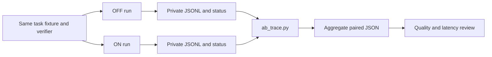

# Reproducible A/B trace accounting

`scripts/ab_trace.py` reads paired `codex exec --json` traces and emits aggregate JSON. It never copies prompts, tool commands, tool output, or trace paths into its report. Keep the raw JSONL files and manifest private; they can contain source code and secrets. Review pair IDs before publishing a report because IDs are retained.



Create a private manifest next to the traces. This example is illustrative; its paths must be replaced with real runs. `fixture_sha256` is the SHA-256 of an identical task fixture used by both arms. Record elapsed time with the same monotonic clock and verifier exit codes from an independent check. The `order` field is the actual execution order.

```json
{
  "schema_version": 1,
  "pairs": [
    {
      "id": "fixture-01",
      "fixture_sha256": "aaaaaaaaaaaaaaaaaaaaaaaaaaaaaaaaaaaaaaaaaaaaaaaaaaaaaaaaaaaaaaaa",
      "model": "gpt-6-sol",
      "reasoning_effort": "low",
      "order": ["off", "on"],
      "off": {"trace": "off.jsonl", "elapsed_seconds": 12.4, "process_exit_code": 0, "verifier_exit_code": 0},
      "on": {"trace": "on.jsonl", "elapsed_seconds": 11.8, "process_exit_code": 0, "verifier_exit_code": 0}
    }
  ]
}
```

Run `python3 scripts/ab_trace.py /private/path/manifest.json > /private/path/aggregate.json`. Trace paths can be absolute or relative to the manifest. Run `python3 -m unittest discover -s scripts -p test_ab_trace.py -q` to check the parser.

The report sums provider-reported input, cached input, cache writes, and output tokens across completed turns. It calculates uncached input as `input - cached - cache_write` only when all three fields exist and the result is nonnegative. Missing fields remain `null`; reasoning output is reported separately and is already included in output. `total_input_output_tokens` is a traffic count, not a price estimate. A nonzero tool exit or failed tool item is reported, not assumed to mean the task failed. Exact repeated command strings and reads of hook or explicit-adapter artifacts are proxies for reacquisition; neither captures semantically repeated work.

`measurement_complete` means both runs have a completed turn, usable token fields, zero process exit, no trace-level error or failed turn, and a recorded verifier exit code. It does **not** mean the verifier passed or that the task sample is large enough. Inspect `verified`, timeouts, task quality, and hidden tests separately. The manifest supplies elapsed times and exit codes; the parser cannot authenticate them. CLI and hook schemas may change. Keep raw traces for local audit.

For a new receipt comparison, hold the plugin revision, threshold, model, effort, task prompt, tool permissions, fixture, and verifier fixed. Change only the receipt selection rule; randomize pair order and isolate worktrees and provider session state. Include at least two task families, noisy failures and repository navigation, plus code-mode runs. Predeclare provider total tokens as the primary traffic measure, task verification as a quality gate, and elapsed time, cached/uncached input, tool failures, interrupted chains, artifact reads, and repeated commands as secondary measures. Report every pair and uncertainty by task, including failures and timeouts. Provider cache reuse cannot be forced cold merely by resetting a local worktree; analyze cached and uncached input separately. The earlier plugin OFF/ON pilot changed more than the receipt rule and does not isolate that mechanism.
