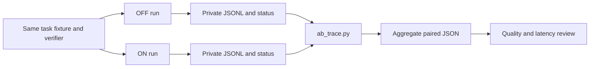

# Reproducible A/B trace accounting

`scripts/ab_trace.py` reads paired `codex exec --json` traces and emits aggregate JSON. It never copies prompts, tool commands, tool output, or trace paths into its report. Keep the raw JSONL files and manifest private; they can contain source code and secrets. Review pair IDs before publishing a report because IDs are retained.


```mermaid
flowchart LR
  A[Same task fixture and verifier] --> B[OFF run]
  A --> C[ON run]
  B --> D[Private JSONL and status]
  C --> E[Private JSONL and status]
  D --> F[ab_trace.py]
  E --> F
  F --> G[Aggregate paired JSON]
  G --> H[Quality and latency review]
```

Create a private manifest next to the traces. This example is illustrative; its paths must be replaced with real runs. `fixture_sha256` is the SHA-256 of an identical task fixture used by both arms. Record elapsed time with the same monotonic clock and verifier exit codes from an independent check. The `order` field is the actual execution order.

```json
{
  "schema_version": 1,
  "pairs": [
    {
      "id": "fixture-01",
      "fixture_sha256": "aaaaaaaaaaaaaaaaaaaaaaaaaaaaaaaaaaaaaaaaaaaaaaaaaaaaaaaaaaaaaaaa",
      "model": "gpt-6-sol",
      "reasoning_effort": "low",
      "order": ["off", "on"],
      "off": {"trace": "off.jsonl", "elapsed_seconds": 12.4, "process_exit_code": 0, "verifier_exit_code": 0},
      "on": {"trace": "on.jsonl", "elapsed_seconds": 11.8, "process_exit_code": 0, "verifier_exit_code": 0}
    }
  ]
}
```

Run `python3 scripts/ab_trace.py /private/path/manifest.json > /private/path/aggregate.json`. Trace paths can be absolute or relative to the manifest. Run `python3 -m unittest discover -s scripts -p test_ab_trace.py -q` to check the parser.

The report sums provider-reported input, cached input, cache writes, and output tokens across completed turns. It calculates uncached input as `input - cached - cache_write` only when all three fields exist and the result is nonnegative. Missing fields remain `null`; reasoning output is reported separately and is already included in output. `total_input_output_tokens` is a traffic count, not a price estimate. A nonzero tool exit or failed tool item is reported, not assumed to mean the task failed. Exact repeated command strings and reads of hook or explicit-adapter artifacts are proxies for reacquisition; neither captures semantically repeated work.

`measurement_complete` means both runs have a completed turn, usable token fields, zero process exit, no trace-level error or failed turn, and a recorded verifier exit code. It does **not** establish complete provider accounting: [OTel development probes](2026-09-24-otel-usage-boundary.md) found WebSocket startup usage outside CLI turn totals and missing usage after `SIGKILL`. It also does not mean the verifier passed or that the task sample is large enough. Inspect `verified`, timeouts, task quality, and hidden tests separately. The manifest supplies elapsed times and exit codes; the parser cannot authenticate them. CLI and hook schemas may change. Keep raw traces for local audit.

For a new receipt comparison, hold the plugin revision, threshold, model, effort, task prompt, tool permissions, fixture, and verifier fixed. Change only the receipt selection rule; randomize pair order and isolate worktrees and provider session state. Include at least two task families, noisy failures and repository navigation, plus code-mode runs. Predeclare provider total tokens as the primary traffic measure, task verification as a quality gate, and elapsed time, cached/uncached input, tool failures, interrupted chains, artifact reads, and repeated commands as secondary measures. Report every pair and uncertainty by task, including failures and timeouts. Provider cache reuse cannot be forced cold merely by resetting a local worktree; analyze cached and uncached input separately. The earlier plugin OFF/ON pilot changed more than the receipt rule and does not isolate that mechanism.

## Expanded development series, 2026-10-02

The [published numerical projection](data/2026-10-02-inline-expanded-development.json) contains all 96 run records and 48 paired observations from 24 predefined controlled Python repairs in 12 pinned repositories, using `gpt-6-luna` at low effort. Each repository contributes four pairs with balanced order. Both versions passed the local repair contracts in 48/48 runs. Baseline traffic was 3,224,137 input-plus-output tokens over 284 requests; inline-policy traffic was 2,912,914 tokens over 261 requests: an observed decrease of 9.653%. Cached input is already included in input.

The frozen saving gate requires the one-sided 95% upper repository-level token ratio to be below 0.95. Its value was 0.952888. The quality gate requires an independent-repository e-product of at least 20; its value was 1.795856. Both predeclared gates remain unsatisfied: **INCONCLUSIVE**, with **HOLD_STATISTICAL_CONFIRMATION**. The repository independence and approximate t-interval assumptions remain necessary. These exposed development repairs are not reused as independent confirmation observations.

The JSON includes per-run usage, pair order, acceptance, 12 repository aggregates, frozen thresholds, source artifact hashes and numerical reproduction formulas. Public readers can reproduce its sums and clustered calculations. The saved private evidence reducer checked raw attempt accounting; this numerical projection does not independently authenticate those raw records or provider billing. The prior pilot, preparation and chat/Astra consultation costs are outside the reported 96-run totals. Timing excludes installation, preflight and grading and is secondary because pairs ran concurrently.

The measured quality boundary is the local contract suite. Full upstream regression quality, monetary savings, other models and broad historical repairs require further evidence. Preparation of a separate confirmatory series has made zero benchmark provider requests; its runtime qualification, preregistration and draw remain unfinished.

## Prospective runtime evidence components, 2026-10-02

The isolated [runtime origin and finalization contracts](../../experiments/runtime_evidence/source_manifest.json) contain 78 synthetic unit-test methods (34 origin, 44 finalization). They validate supplied JSON consistency, alias/event replay and lifecycle/after-exit bindings; they do not implement a protected launcher, an actual native observer or an independently authenticated producer. The lifecycle envelope budget is 2 MiB, with separate full-payload budgets of 8 MiB for origin and 32 MiB for report bytes. Opaque report hashing does not validate report contents.

The existing hosted Validate CI runs `python -m unittest discover -s experiments/runtime_evidence -p 'test_*.py' -v` on Ubuntu and macOS with Python 3.10, 3.11 and 3.12. Outcomes belong to the exact commit's CI logs; test definitions and source review alone do not establish passing execution. The source manifest links reviewed and published hashes; only module docstrings changed after the peer reviews.

These cases are development fixtures with manufactured references and host receipts. They establish no original-image/native event authenticity, Base/Gold qualification, scientific acceptance, resource bound or token-saving claim. Integration, preregistration, sample draw and independent model confirmation remain unfinished; **HOLD_STATISTICAL_CONFIRMATION** is unchanged.
