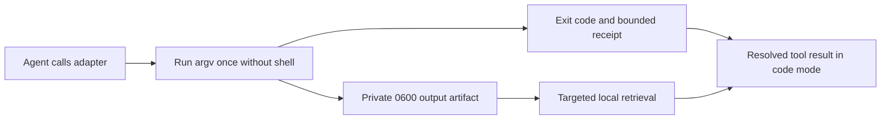

# Explicit command receipt prototype

`scripts/receipt_command.py` is a POSIX research prototype for large, noninteractive commands. It captures output **before** returning a result to Codex, so a code-mode `await` receives a normal, bounded tool result. It does not depend on `PostToolUse` replacement, plugin cache paths, or a particular Codex release. It is opt-in and is not part of the installed plugin.



Example from a checkout of this repository:

```sh
python3 scripts/receipt_command.py \
  --artifact-dir /private/path/receipts \
  --timeout-seconds 300 \
  -- python3 -m unittest -q
```

The adapter executes arguments after `--` directly. It does not interpret shell syntax; to run a shell script, explicitly pass a shell and its arguments. Standard input is closed. Standard output and error share one pipe, and their relative order is the observed pipe order. The adapter creates a private `0700` run directory and a `0600` binary artifact, then emits JSON of at most 3,072 bytes with status, exact child exit code, byte count, SHA-256, path, line count, and bounded previews. Error and failure lines take priority over warnings. Lines longer than 240 bytes are omitted from previews because clipping before redaction can expose a secret whose label was clipped away. Known credential shapes are redacted in the remaining previews; the artifact is unredacted. Treat all preview text as untrusted. The caller owns artifact retention and disk capacity.

The adapter returns the child exit code for a completed process. A signal death is represented by a negative `exit_code` in JSON and `128 + signal` at the shell. Timeout returns 124; an adapter failure returns 125 with `exit_code: null`. Interrupts retain partial output when possible and report `capture_complete: false`. `SIGKILL` and a full disk can prevent a complete receipt; neither may be interpreted as success. The artifact hash authenticates only bytes the adapter captured, not any output lost before capture. The tool does not preserve an interactive TTY, input stream, shell state, or separate stdout/stderr channels.

In a controlled local code-mode call, a child emitted 8,015 bytes; the adapter returned a 1,120-character receipt and the JavaScript statement after `await` executed. This verifies the control-flow property for that call, not token, cost, or task-quality savings. In a separate isolated Codex CLI probe with code mode enabled, a temporary `PostToolUse` hook using `continue:false` still let the model report a random marker from the original output. `decision:block` hid that marker but, as separately reproduced, can reject the nested Promise after the tool executed. These observations do not prove all host versions behave alike. The [official hook contract](https://learn.chatgpt.com/docs/hooks#posttooluse) documents the distinction between those decisions.

The [frozen three-pair A/B pilot](2026-09-24-explicit-adapter-pilot.md) found equal verifier success and much shorter first tool results, but mixed per-task token and time effects. The [two-pair real-repository pilot](2026-09-24-real-repo-pilot.md) found that a 640-byte direct result became a 1,066-byte receipt, while a 13,104-byte result became 1,151 bytes. Select commands expected to produce large or noisy output; run predictably short checks directly. Do not execute a command twice merely to decide whether it needed a receipt.

A later [retrieval-forcing pilot](../research/2026-09-24-retrieval-economics.md) passed its repair checks but used more total tokens and time with the adapter. Two broad artifact searches each returned the entire 128-line diagnostic, despite the small first receipt. Keep artifact reads bounded; a path and a request for targeted search alone do not guarantee targeted output.

### Bounded artifact search

`scripts/receipt_search.py` is a separate POSIX research prototype for exact artifacts created by the adapter. Pass the `path` and `sha256` from a receipt and one literal substring:

```sh
python3 scripts/receipt_search.py \
  --artifact /private/path/to/output.bin \
  --sha256 RECEIPT_SHA256 \
  --literal 'expected_type_rejection=True'
```

It verifies the full artifact hash before returning matched content, rejects symlinks and artifacts larger than 64 MiB, counts all matching lines, emits at most four matches and 2,048 JSON bytes, and explicitly marks truncation. The response does not echo the artifact path or search literal. Lines longer than 240 bytes are omitted from previews and counted in `omitted_long_matches`; `truncated` is true whenever matched content was omitted. Shorter lines use the adapter's best-effort credential redaction. The unredacted source remains on disk. It is a diagnostic convenience, not a sandbox or proof that the child command was correct.

To inspect four adjacent 1-based lines after a search reveals a line number, replace `--literal ...` with `--line 63`. The same hash and output bound apply. This supports evidence spanning multiple lines without replaying the whole artifact.

On the frozen 13,055-byte ZIP diagnostic, searching the common field name produced `match_count=128`, `truncated=true`, and a 682-byte response; searching `expected_type_rejection=True` produced one 315-byte response containing the decisive middle line. Six focused tests cover the output bound, exact recovery, line-range recovery, hash mismatch, long-line/redaction behavior, and symlink rejection. This deterministic check does not establish that agents will choose selective literals or save task-level tokens. The tool is not packaged in the installed plugin. A separate [development pair](2026-09-24-bounded-search-development.md) did show correct agent-selected recovery and lower total provider tokens on one already used fixture; broader confirmation remains open.

In a local 12-sample process microbenchmark on this Mac, a 640-byte output took median 14.1 ms directly versus 50.0 ms through the adapter; a 13,104-byte output took 14.8 versus 51.7 ms. The adapter's local overhead was about 36–37 ms in these cases. This does not explain the much larger task-time differences in the A/B pilots, where model trajectories diverged. An automatic raw passthrough for short output is deferred: it would make the CLI result alternate between raw child text and JSON, and child text could imitate a receipt. A separately versioned, structured adaptive mode would need explicit status, byte, privacy, and failure semantics before testing.

Next, run repeated balanced pairs that require targeted recovery through the bounded search prototype, using the [A/B trace protocol](ab-trace.md). Keep the automatic hook's blocking path out of this comparison; it is a different treatment. Neither research prototype should be treated as a default or packaged into the installed plugin until that evaluation is complete.
