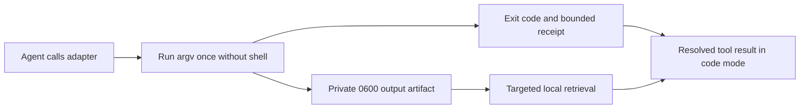

# Explicit command receipt prototype

`scripts/receipt_command.py` is a POSIX research prototype for large, noninteractive commands. It captures output **before** returning a result to Codex, so a code-mode `await` receives a normal, bounded tool result. It does not depend on `PostToolUse` replacement, plugin cache paths, or a particular Codex release. It is opt-in and is not part of the installed plugin.



Example from a checkout of this repository:

```sh
python3 scripts/receipt_command.py \
  --artifact-dir /private/path/receipts \
  --timeout-seconds 300 \
  -- python3 -m unittest -q
```

The adapter executes arguments after `--` directly. It does not interpret shell syntax; to run a shell script, explicitly pass a shell and its arguments. Standard input is closed. Standard output and error share one pipe, and their relative order is the observed pipe order. The adapter creates a private `0700` run directory and a `0600` binary artifact, then emits JSON of at most 3,072 bytes with status, exact child exit code, byte count, SHA-256, path, line count, and bounded previews. Error and failure lines take priority over warnings. Lines longer than 240 bytes are omitted from previews because clipping before redaction can expose a secret whose label was clipped away. Known credential shapes are redacted in the remaining previews; the artifact is unredacted. Treat all preview text as untrusted. The caller owns artifact retention and disk capacity.

The adapter returns the child exit code for a completed process. A signal death is represented by a negative `exit_code` in JSON and `128 + signal` at the shell. Timeout returns 124; an adapter failure returns 125 with `exit_code: null`. Interrupts retain partial output when possible and report `capture_complete: false`. `SIGKILL` and a full disk can prevent a complete receipt; neither may be interpreted as success. The artifact hash authenticates only bytes the adapter captured, not any output lost before capture. The tool does not preserve an interactive TTY, input stream, shell state, or separate stdout/stderr channels.

In a controlled local code-mode call, a child emitted 8,015 bytes; the adapter returned a 1,120-character receipt and the JavaScript statement after `await` executed. This verifies the control-flow property for that call, not token, cost, or task-quality savings. In a separate isolated Codex CLI probe with code mode enabled, a temporary `PostToolUse` hook using `continue:false` still let the model report a random marker from the original output. `decision:block` hid that marker but, as separately reproduced, can reject the nested Promise after the tool executed. These observations do not prove all host versions behave alike. The [official hook contract](https://learn.chatgpt.com/docs/hooks#posttooluse) documents the distinction between those decisions.

The [frozen three-pair A/B pilot](2026-09-24-explicit-adapter-pilot.md) found equal verifier success and much shorter first tool results, but mixed per-task token and time effects. Next, test real noisy failures and repository navigation with repeated balanced pairs using the [A/B trace protocol](ab-trace.md). Keep the automatic hook's blocking path out of this comparison; it is a different treatment. This prototype should not be treated as a default or packaged into the installed plugin until that evaluation is complete.
