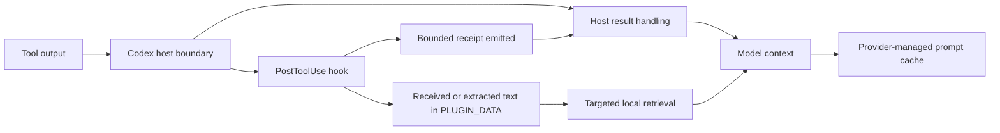

# Context-efficiency research map (2026-09-23)

This note separates published results from changes SoL Codex can actually test. It is a research plan, not a performance claim or a change in the released plugin.

## Starting point and control boundary

SoL Codex 0.1.8 archives eligible `PostToolUse` output, returns a bounded receipt, tracks verification debt, and preserves an already initialized hook runtime after its plugin cache path is pruned. It sees only output Codex has passed to the hook; host-side truncation has already happened. Its durable `PLUGIN_DATA` snapshot is a copy of local hook code, not the provider's prompt/KV cache. See [architecture](../architecture.md), [measurement methodology](../savings.md), and the [five-pair pilot](../measurements/2026-09-23-ab-threshold.md).

The hook can emit a bounded receipt, but the tested host still passed the original result into the next model request with the released non-blocking response; the [boundary study](2026-09-24-hook-result-boundary.md) records the direct and code-mode counterexamples. It cannot rewrite earlier model-visible messages, choose provider cache breakpoints, or initiate Codex compaction. A structured result is flattened to extracted text before archival, so its artifact does not preserve the original object structure. In observed code-mode calls, `decision: block` rejected a nested Promise after the command had executed. The [Codex hook contract](https://learn.chatgpt.com/docs/hooks) describes `PostToolUse` behavior and compaction events. The [OpenAI prompt-caching guide](https://developers.openai.com/api/docs/guides/prompt-caching) says cache reuse depends on a matching prefix and that compaction may reduce reuse. These API-level facts do not establish how much cache a Desktop task actually reuses.

## Relevant work

| Source | Reported finding | SoL Codex implication |
| --- | --- | --- |
| [NVIDIA SoL-Pi](https://arxiv.org/abs/2609.20519) | Four mechanisms: action fusion, cache-cost-gated compaction, delayed observation packing, and an evidence-preserving reducer. On EdgeBench, the combined efficiency harness reported 44.7–49.0% less token traffic than Pi, with comparable average scores. On 63 CPU-only Terminal-Bench 4 tasks it solved 15 versus Pi's 18. | Our action-fusion skill and receipt archive cover adjacent ideas. Delayed replacement of prior results and host compaction need a different host surface. Efficiency and success must be gated separately. Its numbers do not transfer to this plugin. |
| [Microsoft Research ACON](https://arxiv.org/abs/2510.00615) | Learns compression guidelines from pairs where full context succeeds and compressed context fails; reports 26–54% lower peak token use on its evaluated agent tasks. | Use failed *local* A/B trajectories to tune deterministic receipt rules before considering a model-based compressor. Peak tokens are not total cost. |
| [Anthropic context engineering](https://www.anthropic.com/engineering/effective-context-engineering-for-ai-agents) and [long-running harnesses](https://www.anthropic.com/engineering/effective-harnesses-for-long-running-agents) | Advocate selective retrieval, clearing stale tool results, and durable structured notes across context resets. | Keep exact artifacts addressable. Durable task state is worth testing, but broad cross-task memory needs a separate relevance and privacy design. Hook events alone cannot clear earlier transcript content. |
| [Scroll: Context as an Environment](https://arxiv.org/abs/2608.21690) | An append-only event log and compact pointers let agents retrieve exact earlier material on demand. | Add a cheap local artifact index and bounded range/search retrieval; no persistent Python kernel is needed for the first experiment. |
| [Google Research ReasoningBank](https://arxiv.org/abs/2509.25140) | Distills strategies from successful and failed trajectories; its Gemini 2.5 Flash SWE-Bench-Verified result rises from 34.2% to 38.8% versus its memory-free baseline. | A later, separate experiment could preserve vetted project-specific lessons rather than raw output. The published gain is not evidence for our workload. |
| [Don't Break the Cache](https://arxiv.org/abs/2601.06007) and [OpenAI prompt caching](https://developers.openai.com/api/docs/guides/prompt-caching) | Prefix stability affects cost and latency. The paper reports 41–80% API cost reductions from prompt caching on its research-agent benchmark; OpenAI documents that changing tools or compaction can alter reusable prefixes. | Record cached, uncached, and cache-write tokens separately. Do not treat local artifact survival as preservation of the provider cache or promise that a stable task always gets cache hits. |
| [What Does Context Compression Cost an Agent?](https://arxiv.org/abs/2608.16370) | In a controlled setting, compression raised retrieval calls even when completion did not change significantly; the effect varied by environment. | Count artifact reopens, repeated commands, and time to completion. Bytes saved can hide reacquisition cost. |
| [Active Context Compression](https://arxiv.org/html/2601.07190) | A Focus scaffold on five SWE-bench Lite tasks with Claude Haiku 4.5 reported 22.7% fewer total tokens with 3/5 successes in both arms; one task used 110% more tokens. Aggressive prompting was revised after weaker initial behavior. | Phase-boundary context withdrawal is a distinct hypothesis from receipt packing. Five tasks cannot establish quality noninferiority; count summary overhead, rereads, cache categories, and time in any Codex test. |
| [Control Under Compression](https://arxiv.org/html/2608.01056) | Across nine agent control contexts and three fixed Qwen endpoints, the authors report 93.8% success at full context and 92.7%/92.4% for two methods retaining 75% of static instructions. At 35%, the best method reached 47.0%; the 75% gap was descriptive, not a formal noninferiority result. | Do not infer safe compression of tools, policies, or recovery rules from a token budget. This study compresses static control text, not tool results; qualify any policy reduction with executable outcomes. |
| [Unreal Agent](2026-09-24-unreal-agent.md) | The authors report lower cost at a rounded equal Terminal-Bench 4.0 pass rate using an asynchronous harness; the linked Harbor job exposes trials and tokens but not the claimed dollar total. | Treat tool scheduling, prompt size, and result format as separable hypotheses. A completed-result hook cannot implement asynchronous model-turn orchestration. |

All reported percentages and scores belong to the cited authors' tasks, models, and harnesses. Most cited papers are preprints. None validates SoL Codex. The [local five-pair pilot](../measurements/2026-09-23-ab-threshold.md) is also too small and synthetic for a general savings claim.

An [explicit command-receipt prototype](../measurements/receipt-adapter.md) now tests a version-independent output boundary. Its [frozen three-pair pilot](../measurements/2026-09-24-explicit-adapter-pilot.md) preserved verifier success and reduced aggregate token traffic, but took longer overall. It remains opt-in while larger tasks and quality are studied.

The [hook result boundary study](2026-09-24-hook-result-boundary.md) tracks the upstream code-mode replacement gap and the non-blocking 0.1.9 mitigation.

The [retrieval-economics follow-up](2026-09-24-retrieval-economics.md) adds newer primary research and a pilot in which the decisive diagnostic line falls outside the receipt preview.

The [cost-frontier protocol](2026-09-24-cost-frontier.md) incorporates additional billed-cost studies and sets a held-out confirmation target. A [bounded-search development pair](../measurements/2026-09-24-bounded-search-development.md) passed both verifiers with lower total provider tokens on a previously used fixture; it is not confirmatory evidence.

A [quiet-pytest preflight](../measurements/2026-09-25-quiet-diagnostic-preflight.md) tests an ordinary command-format control before another receipt treatment: shorter first diagnostics kept identical collected tests and outcomes on two exposed parent/fix pairs. It made no model requests, so byte reduction is not a token or quality result.

## Ranked experiments

1. **Measure total work before changing compression.** The [aggregate-only A/B trace parser](../measurements/ab-trace.md) now records provider-reported cached input, uncached input, cache writes where exposed, output tokens, elapsed time, tool calls, repeated commands, artifact retrievals, and verifier results. Keep the current 0.1.8 behavior as control. The next experiment must also record interrupted code-mode chains and timeouts outside the trace. Report unavailable provider fields as unavailable, not zero.
2. **Test evidence-first receipts.** For known-status build and test output, compare today's bounded head/tail/signals with a deterministic extractor that prioritizes failing test names, assertions, error spans, file/line references, and exit status while retaining an exact artifact handle. Preserve today's unknown-status test-output exception. Escape or redact displayed lines; never turn a log's claims into trusted instructions or infer success from prose. Fall back to the current receipt or original output if extraction fails or is larger.
3. **Test exact retrieval ergonomics.** A [bounded literal-search prototype](../measurements/receipt-adapter.md#bounded-artifact-search) now verifies the artifact digest and caps returned matches. The [first retrieval-forcing pair](2026-09-24-retrieval-economics.md) showed why: broad raw `rg` queries replayed the diagnostic twice. Test whether agents use the bounded interface successfully, then compare its retrieval work and task quality with ordinary `rg`/`sed`; only expand the interface if it measurably helps.
4. **Then test adaptive thresholds.** Compare current fixed 4/6 KiB defaults with a rule based on output type and measured evidence density. Predeclare task-quality floors. Do not tune on the held-out tasks or use byte savings as the acceptance criterion.

Use at least two task families beyond the current three-file Python fixtures, including noisy failed builds and repository navigation. Freeze revisions, models, effort, time limits, prompts, and verifier rules; randomize paired order; isolate state between arms; keep hidden tests; report paired differences and failures. Select a change only if capability stays above the declared floor **and** total token cost or task time improves. Count retrieval and repeated work so compression does not simply move cost to later turns. Follow [the existing A/B protocol](../savings.md#future-ab-measurement).

## Deferred work

- A model-based reducer can be revisited after deterministic extraction has a measured ceiling; it adds latency, expense, and a verification boundary.
- Context compaction scheduling, clearing old tool results, and provider cache-breakpoint selection require host/API control that the current plugin hook does not expose. Track upstream support rather than relying on transcript file formats.
- KV-cache compression research concerns the inference service, not a local hook. A local runtime snapshot cannot restore an expired or invalidated provider cache.
- Cross-task memory should follow a separately reviewed policy for relevance, provenance, secrets, retention, and user control. It is not part of the next efficiency A/B.
