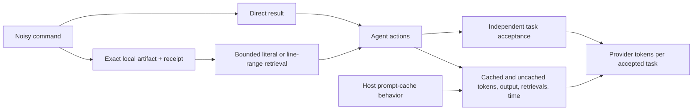

# Cost frontier and confirmation protocol (2026-09-24)

The [bounded-search development pair](../measurements/2026-09-24-bounded-search-development.md) moved in the right direction, but one previously used defect cannot establish savings. A second [cache-boundary pair](../measurements/2026-09-24-cache-boundary-development.md) also used fewer provider tokens at equal verifier success, while taking longer. Neither pair establishes general savings. This note widens the evidence base and fixes the outcome we need to test next.

## External evidence

| Primary source | What the authors measured | Boundary for SoL Codex |
| --- | --- | --- |
| [Token Reduction Is Not Cost Reduction, v5](https://arxiv.org/html/2607.12161) | A hash-frozen Claude Code campaign analyzed 2,848 provider-billed runs from 103 tasks. One arm removed 38.4% of estimated raw tool-output tokens but had 6.8% higher paired billed cost. A separate 40-pair Codex replication associated a proxy with 12.49% lower *reconstructed* cost at equal success, while wall time rose 238.5%; that proxy reported zero compressed tokens. | Measure whole-task provider categories and quality. Do not attribute a cost difference to compression merely because an arm uses a compression tool. Its single-prompt cost decomposition is specific to those harnesses and bills. |
| [The Complexity Trap, v3](https://arxiv.org/abs/2508.21433) | On SWE-agent/SWE-bench Verified across five model settings, masking older observations roughly halved cost versus raw history while rivaling summarization; the authors report a further decrease for a hybrid. | A simple, model-free baseline belongs in future host-level comparisons. Masking *old* observations is a different intervention from reducing a new tool result, and current hooks cannot rewrite prior Codex history. |
| [AgentDiet, v2](https://arxiv.org/abs/2509.23586) | On one coding-agent scaffold, two models, and two benchmarks, pruning useless/expired trajectory content reduced reported input tokens 39.9–59.7% and computed total cost 21.1–35.9% at the authors' measured performance. | Long-session trajectory state may offer more headroom than one command. The installed hook lacks that transcript-editing boundary; adaptation needs a different host/API capability and its own verification. |
| [Recursive Language Models, v3](https://arxiv.org/abs/2512.24601) | Externalized prompts and programmatic inspection/subcalls handled long-context tasks at comparable reported cost in the paper's evaluations. | Programmatic filtering is a plausible alternative to a fixed preview, but recursive model calls are a different and potentially expensive treatment. Its benchmarks are not a Codex repair-loop result. |
| [Don't Break the Cache](https://arxiv.org/html/2601.06007) | Across 500 multi-turn research-agent sessions on three providers, the authors report 41–80% lower API cost and 13–31% lower time to first token with prompt caching. Stable prompt boundaries were more reliable than caching dynamic tool content. | A host-level cache strategy can dominate our small tool-output intervention. The published task is web research, and the Codex CLI does not expose the same cache-boundary controls to this plugin. Record cache categories and keep tool definitions stable. |
| [Cache-Aware Prompt Compression](https://arxiv.org/html/2607.15516) | The authors model compression jointly with cache writes/reads and report lower measured Anthropic API cost for query-agnostic compression in their evaluated settings; a 50-task retail benchmark had the same deterministic reward as their vanilla arm (36/50). | The measured cache tiers and cost ratios are specific to Sonnet 4.6 and its API. A receipt with a fixed schema may preserve a reusable prefix, but that is a hypothesis for Codex, not a transferred result. Avoid using raw token count as a dollar proxy. |

The billed-cost study estimates that user-modifiable content was about 6% of cost in its single-prompt Claude Code benchmark, with tool output about 3.3%; its separate interactive-session analysis found a different mix. These are **not** Codex percentages. They suggest that a small single-prompt fixture may have too little addressable work for a broad money-saving claim. Our current Codex CLI traces expose token categories and time, not a provider bill.

The cache studies also motivate a second falsifiable prediction: a shorter dynamic tool result could lower total tokens while changing the mix of cache reads and uncached input enough to erase monetary savings. We can test the token and cache-mix part with CLI telemetry. Actual billed cost would require billing records or a justified provider-specific price model, neither of which this experiment has.

## Mechanism and falsifiable claim

The narrow claim worth testing is that **for selected noisy commands with sparse decisive evidence**, an exact artifact plus bounded retrieval lowers provider-reported total input/output tokens per accepted task without degrading completion or materially increasing time. The selection policy must be specified before the command executes; running it twice to decide whether to capture would hide extra work. Short outputs and dense test failures remain direct controls.

The search tool now reports omitted long matches and supports a four-line window by 1-based line number, so a single matching line can lead to nearby evidence. These changes are component behavior only. A model must independently choose useful queries and produce an accepted repair for them to count as agent benefit.

## Confirmation design

1. Freeze tool versions, model, effort, Codex version, prompts, command-selection policy, timeouts, and independent verifiers before held-out runs. Keep the already used ZIP case in development only.
2. Use three families: noisy build/dependency failures, multi-file API changes with misleading symbol matches, and upgrade/state-recovery defects. Include short-output negative controls and cases requiring multiple adjacent lines. Do not count permutations of one defect as independent tasks.
3. Randomize OFF/ON order within each family and isolate working copies and Codex homes. OFF uses ordinary direct commands. ON uses the same task plus a predeclared adapter/search policy; its longer instructions are part of the treatment. A third receipt-with-raw-search arm can isolate the bounded-search mechanism on a smaller subset.
4. Primary outcome: total provider-reported input plus output tokens divided by independently accepted tasks, with failures and timeouts retained in the numerator. Report cached, uncached, cache-write, and output tokens separately. Actual billed dollars remain unavailable unless a provider bill becomes available. Secondary outcomes: paired success, time, tool calls, artifact reads, repeated commands, first-result bytes, and local search work.
5. Treat development observations as hypothesis generation. For a strong claim, aim for at least 60 distinct held-out tasks across families and task-clustered paired uncertainty. An explicit target is at least 15% lower success-adjusted token use, a 95% interval excluding no saving, and no more than five percentage points of success loss; small samples cannot establish that quality floor. Review all invalid attempts and integrity problems before analyzing results.

A deliberately unusual third hypothesis stays open: a receipt with **no diagnostic preview**, only status, size, hash, and retrieval handle, might prevent early but misleading error lines from anchoring a wrong diagnosis. Compare it with the current preview on tasks with decoy messages. It fails if extra retrieval consumes the gain or harms repair success. This is a separate experiment, not a reason to remove previews now.
