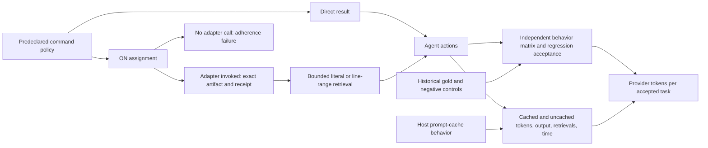

# Cost frontier and confirmation protocol (2026-09-24)

The [bounded-search development pair](../measurements/2026-09-24-bounded-search-development.md) moved in the right direction, but one previously used defect cannot establish savings. A second [cache-boundary pair](../measurements/2026-09-24-cache-boundary-development.md) also used fewer provider tokens at equal verifier success, while taking longer. A third [historical CRLF pair](../measurements/2026-09-24-historical-crlf-development.md) exposed a verifier gap: both arms failed the complete behavior matrix, and ON used more tokens. None establishes general savings. This note widens the evidence base and fixes the outcome we need to test next.

## External evidence

| Primary source | What the authors measured | Boundary for SoL Codex |
| --- | --- | --- |
| [Token Reduction Is Not Cost Reduction, v5](https://arxiv.org/html/2607.12161) | A hash-frozen Claude Code campaign analyzed 2,848 provider-billed runs from 103 tasks. One arm removed 38.4% of estimated raw tool-output tokens but had 6.8% higher paired billed cost. A separate 40-pair Codex replication associated a proxy with 12.49% lower *reconstructed* cost at equal success, while wall time rose 238.5%; that proxy reported zero compressed tokens. | Measure whole-task provider categories and quality. Do not attribute a cost difference to compression merely because an arm uses a compression tool. Its single-prompt cost decomposition is specific to those harnesses and bills. |
| [The Complexity Trap, v3](https://arxiv.org/abs/2508.21433) | On SWE-agent/SWE-bench Verified across five model settings, masking older observations roughly halved cost versus raw history while rivaling summarization; the authors report a further decrease for a hybrid. | A simple, model-free baseline belongs in future host-level comparisons. Masking *old* observations is a different intervention from reducing a new tool result, and current hooks cannot rewrite prior Codex history. |
| [AgentDiet, v2](https://arxiv.org/abs/2509.23586) | On one coding-agent scaffold, two models, and two benchmarks, pruning useless/expired trajectory content reduced reported input tokens 39.9–59.7% and computed total cost 21.1–35.9% at the authors' measured performance. | Long-session trajectory state may offer more headroom than one command. The installed hook lacks that transcript-editing boundary; adaptation needs a different host/API capability and its own verification. |
| [Recursive Language Models, v3](https://arxiv.org/abs/2512.24601) | Externalized prompts and programmatic inspection/subcalls handled long-context tasks at comparable reported cost in the paper's evaluations. | Programmatic filtering is a plausible alternative to a fixed preview, but recursive model calls are a different and potentially expensive treatment. Its benchmarks are not a Codex repair-loop result. |
| [Don't Break the Cache](https://arxiv.org/html/2601.06007) | Across 500 multi-turn research-agent sessions on three providers, the authors report 41–80% lower API cost and 13–31% lower time to first token with prompt caching. Stable prompt boundaries were more reliable than caching dynamic tool content. | A host-level cache strategy can dominate our small tool-output intervention. The published task is web research, and the Codex CLI does not expose the same cache-boundary controls to this plugin. Record cache categories and keep tool definitions stable. |
| [Cache-Aware Prompt Compression](https://arxiv.org/html/2607.15516) | The authors model compression jointly with cache writes/reads and report lower measured Anthropic API cost for query-agnostic compression in their evaluated settings; a 50-task retail benchmark had the same deterministic reward as their vanilla arm (36/50). | The measured cache tiers and cost ratios are specific to Sonnet 4.6 and its API. A receipt with a fixed schema may preserve a reusable prefix, but that is a hypothesis for Codex, not a transferred result. Avoid using raw token count as a dollar proxy. |
| [Empirical Cost Attribution of Context-Compression Gateways, v1](https://arxiv.org/html/2609.22114v1) | In the authors' isolated gateway runs, content compression changed a turn-aligned Sonnet/Claude Code prefix by about 1.5–2K tokens after a file read; a five-turn read-only sequence showed cumulative savings from repeated history. Their large 21K–57K tool-schema headline applies mainly to tool-heavy setups: §3.1 reports only 128–256 tokens saved for the tested nine-tool Codex configuration when core tools remain available. | Neither the short sequence's quadratic fit nor the tool-filter headline transfers to our Codex receipt path. Count entire provider requests at cache tiers and all exact-output recalls; freeze tool inventory. The paper's single-shot 86.5% *retained* solve quality is not a repair-loop cost or noninferiority result. |
| [SWE Context Bench, v3](https://arxiv.org/html/2602.08316v3) | On its 99 related Lite tasks, Table 4 reports no-context 26.26% resolved at $0.79/task and oracle summaries 34.34% at $0.85/task; free summaries scored 22.22% at $0.91/task. Oracle guidance improved resolution there while increasing average per-task cost and time. | Related-task memory is different from a within-task phase reset or a command receipt. The abstract's broad efficiency claim needs its setting and estimand: higher acceptance can improve cost per accepted repair even while total cost per assigned task rises. Evaluate relevance, correctness, retrieval overhead, and both denominators separately. |
| [Agent Retrieval Bench](https://arxiv.org/html/2607.24882) | The authors released 427 repository-context retrieval samples across 25 repositories, including 50 natural no-gold cases and 32 wrong-repository controls. No retrieval method dominated every task type; their controlled seed pilot is a retrieval result, not patch acceptance. | Measure whether the decisive evidence was found before editing, and include natural no-evidence controls. This benchmark retrieves repository files, not command artifacts, so its scores do not transfer to our adapter. |
| [Unreal Agent](2026-09-24-unreal-agent.md) | Its authors report 57.9% at $1,428 versus a separate Codex leaderboard result of 57.9% at $2,350 on Terminal-Bench 4.0 with Astra `xhigh`. The public Harbor job shows 330 trials and tokens, but no inference cost; the article does not link Codex trial traces. | Async scheduling and durable tool state are a separate host-level intervention. The 39.23% reported cost difference does not measure our receipt hook or prove causal savings at paired quality. |
| [RRSI](2026-09-24-rrsi.md) | Regularized harness evolution reports better out-of-distribution transfer than score-only evolution. In its workspace ablation, 2.42m policy tokens/trial is below unregularized evolution's 3.80m but above the unevolved harness's 1.56m. | Record rejected hypotheses, bound candidate complexity, screen leakage before scoring, and freeze a once-only held-out set. Evaluate full-task and search-amortized cost against the original harness; token savings relative only to another evolved harness are insufficient. |
| [AgentIF](https://arxiv.org/html/2505.16944) | Its 707 annotated instructions from 50 agentic applications include tool and conditional constraints; the authors report that even their best evaluated model perfectly followed fewer than 30% of complete instructions. | Prompting an agent to use an optional adapter is an intervention with an adherence failure mode. Audit actual invocation and condition triggering. This benchmark is neither a Codex repair benchmark nor an estimate of our adapter compliance rate. |
| [Coding-agent configuration adherence study](https://arxiv.org/abs/2605.10039) | Across 1,650 Claude Code CLI sessions on five TypeScript tasks, the four tested configuration-file structure variables had no detectable contrast after multiple-testing correction for a simple annotation rule. The within-session compliance association was exploratory. | Moving a receipt rule to another position or file is not a proven fix for our observed nonadherence. The measured rule, model, and instruction surface differ from our first-command CLI prompts. |
| [Arena HarnessTax](https://arena.ai/blog/coding-agents-harness-tax) | Twenty-one model–harness combinations were compared on 30 sampled tasks from each of SWE-bench Lite and Terminal-Bench 2.0, with three attempts per task. The same model could have similar success and substantially different modeled API cost across harnesses. | Harness choice is a plausible high-leverage research axis, but this small, older benchmark sample neither identifies async scheduling as the cause nor establishes a saving for this plugin. |

The billed-cost study estimates that user-modifiable content was about 6% of cost in its single-prompt Claude Code benchmark, with tool output about 3.3%; its separate interactive-session analysis found a different mix. These are **not** Codex percentages. They suggest that a small single-prompt fixture may have too little addressable work for a broad money-saving claim. Codex CLI traces expose token categories and time for completed turns, not a provider bill. Our [OTel probes](../measurements/2026-09-24-otel-usage-boundary.md) found additional WebSocket startup usage outside the CLI turn total and unknown usage after an abrupt stop.

The cache studies also motivate a second falsifiable prediction: a shorter dynamic tool result could lower total tokens while changing the mix of cache reads and uncached input enough to erase monetary savings. CLI telemetry can test the token and cache mix **within recorded completed turns**; full-attempt accounting needs an independent ledger. Actual billed cost would require billing records or a justified provider-specific price model, neither of which this experiment has.

## Mechanism and falsifiable claim

The narrow claim worth testing is that **for selected noisy commands with sparse decisive evidence**, an exact artifact plus bounded retrieval lowers provider-reported total input/output tokens per accepted task without degrading completion or materially increasing time. The selection policy must be specified before the command executes; running it twice to decide whether to capture would hide extra work. Short outputs and dense test failures remain direct controls.

The [natural historical development runs](../measurements/2026-09-24-natural-history-development.md) add a separate adherence gate. Click and packaging agents completed repairs but made no adapter calls even when ON produced several outputs above 6 KiB. Their higher ON token use measures the assigned instructions and divergent agent behavior, not receipt compression. A forced first-command SQLGlot probe is a distinct development treatment; it cannot be pooled with those unexecuted-adapter pairs as one mechanism estimate. The 300-second timeout in its first OFF arm left no `turn.completed` usage. A second SQLGlot series captured complete usage but ON made no repair while OFF passed 13/13, showing why lower token use without accepted quality is insufficient.

The same [development ledger](../measurements/2026-09-24-natural-history-development.md#sympy-arraysymbol-apparent-token-reduction-post-hoc-regression) includes one SymPy pair on a different repository with actual adapter use. Both arms passed a frozen 35/35 matrix and 48/48 selected upstream tests; ON used 31.8% fewer provider-reported tokens while taking 5.4% longer. Source review then found both agents changed `_ArrayExpr` instead of only `ArraySymbol`. A post-hoc control detected changed `ZeroArray` and `OneArray` iterable/flatten behavior. The [API-contract reassessment](../measurements/2026-09-24-sympy-contract-reassessment.md) found no independently established requirement to preserve that behavior; repair acceptance is unresolved. The token difference is not a quality-adjusted saving. Future sibling-class controls need specification review before they become acceptance criteria. The SymPy issue and historical fix were exposed before selection, only one seed was run, and the treatment changed instructions and trajectories. No billing record exists. Keep it out of the held-out numerator and choose new untouched tasks for confirmation.

The search tool now reports omitted long matches and supports a four-line window by 1-based line number, so a single matching line can lead to nearby evidence. These changes are component behavior only. A model must independently choose useful queries and produce an accepted repair for them to count as agent benefit. The three development pairs all used a task-specific 128-case diagnostic with one middle mismatch; changing the defect does not make that retrieval pattern independent. Confirmation must let agents choose diagnostics and allow the direct arm to use normal shell filtering.

## Confirmation design

1. Freeze tool versions, model, effort, Codex version, exact prompts, command-selection policy, timeouts, and independent verifiers **before** held-out runs. Any treatment change starts a new series. Keep all three existing pairs in development only. The current experiments test an external adapter plus instructions with hooks disabled; they do not measure the installed plugin as a whole.
   Keep a [proposal history and rejection ledger](2026-09-24-rrsi.md) across revisions, including failed hypotheses and the task families already exposed. Once outcomes from a supposedly held-out family guide another candidate, move that family to development and select a new untouched confirmation set.
2. Define the population and enumerate candidate historical fixes before selecting tasks. Use independent root causes from several repositories and dates, cluster follow-up fixes/reverts of one incident, verify the parent fails and the historical fix passes, and publish selection seed and exclusions before ON/OFF outcomes. Export each parent tree into a fresh one-commit repository; keep future commits, golden patches, hidden checks, and tool paths that expose a fixed checkout outside agent-visible filesystem scope. A one-commit Git export alone does not enforce that scope; the [macOS isolation probe](../measurements/2026-09-24-agent-isolation-probe.md) is only a development check. Without Docker, report the native OS/toolchain/dependency and filesystem-isolation limits explicitly.
3. Use three families: noisy build/dependency failures, multi-file API changes with misleading symbol matches, and upgrade/state-recovery defects. Include natural short-output and no-evidence controls and cases requiring multiple adjacent lines. Do not count permutations of one defect or the same 128-case diagnostic template as independent tasks. Issue-style prompts should state symptoms without requiring a particular diagnostic or edit file.
4. Randomize OFF/ON order within each family and isolate working copies and Codex homes. OFF can use ordinary shell filtering and redirection. ON receives the same task plus a predeclared rule for when to use the adapter/search; the extra instructions, unused adapter opportunities, and fallbacks remain part of the treatment. Predeclare and audit whether the adapter was actually invoked on the intended command. A pair with no ON invocation may inform instruction adherence but cannot identify receipt compression's effect. Run the arms sequentially with equal budgets and record order, timeouts, and cache categories. A third receipt-with-raw-search arm can isolate bounded search on a smaller development subset.
5. Accept a task only with independent functional and regression checks covering the stated behavior, including relevant boundary combinations and negative controls. Test the verifier on the parent and historical fixed tree before running either arm. Evaluate patches in a clean copy outside the agent's workspace; a passing existing suite alone is insufficient. The CRLF pair shows why this gate is necessary.
6. Primary outcome: for each arm, sum **all attempts'** provider-reported input plus output tokens and divide by the number of independently accepted tasks. Failures and timeouts remain in the numerator. Report cached, uncached, cache-write, and output tokens separately, plus the four paired success outcomes. Actual billed dollars remain unavailable unless a provider bill becomes available. Secondary outcomes: full elapsed time per accepted task, tool calls, artifact reads, repeated commands, first-result bytes, evidence found before editing, and local search work. Publish a symbolic price break-even inequality from category deltas; apply a price schedule only after verifying its provider, model, and date.
7. Account for incomplete telemetry before analysis. `turn.completed` usage can omit WebSocket startup work even after normal completion and can be absent after interruption even when work was consumed; never substitute zero or silently drop a failed attempt. A local OTel collector helps diagnose but can lose buffered usage when the CLI dies. Predefine an independently auditable provider source or conservative missing-cost bounds. If neither is available, the corresponding economy claim remains unresolved. Keep infra failures distinct from task and treatment failures.
   Include proposal/search spend when reporting deployment economics: for expected lifetime task count `N`, compare `search_cost + N × task_cost` against the frozen baseline. Keep this separate from the per-task cost metric.
8. Treat development observations as hypothesis generation. Choose the confirmatory sample size from both quality and cost precision, across multiple repositories. The working target is a point estimate of at least 15% lower tokens per accepted task with a paired, task-clustered 95% interval excluding no saving, and a separate paired success-rate interval whose lower bound exceeds −5 percentage points. For the stronger claim that savings are **at least** 15%, the upper ratio bound must be below 0.85, not merely below 1. Report leave-one-repository-out sensitivity and a predeclared elapsed-time limit. A conservative zero-harm binomial bound at two-sided 95% needs at least 72 independent tasks to put the upper harm probability below 5%; 60 tasks cannot guarantee this quality gate. This is a lower bound, not a powered design. The [360-task preregistration draft](2026-09-24-confirmation-campaign-draft.md) adds selection, verifier, isolation, and request-accounting gates; it is not yet frozen. Do not extend the sample merely because the interim result looks promising.

A deliberately unusual third hypothesis stays open: a receipt with **no diagnostic preview**, only status, size, hash, and retrieval handle, might prevent early but misleading error lines from anchoring a wrong diagnosis. Compare it with the current preview on tasks with decoy messages. It fails if extra retrieval consumes the gain or harms repair success. This is a separate experiment, not a reason to remove previews now.

Another falsifiable idea is an **automatic internal phase reset** at diagnosis → edit → verification. An external orchestrator could hand a fresh agent session a bounded, provenance-linked state summary and the same repository, without asking the user to start another chat. Test it separately on natural long tasks, counting summary generation, all sessions, lost cache reuse, repeated navigation, quality, and time. The hypothesis fails if forgotten constraints or reacquisition erase the saving.

A first [one-task development pilot](../measurements/2026-09-24-phase-reset-development.md) exercised diagnosis → edit reset on exposed packaging #928. Both repairs passed the external matrix and full upstream suite; counting their common diagnosis, reset had 20.0% fewer CLI-reported tokens but took 10.23% longer. The fixed order, one seed, different patches, evaluator correction, and incomplete provider accounting prevent any causal or general claim. The pilot validates the session mechanism and motivates a frozen, randomized multi-task screen, not a change to the installed plugin.
