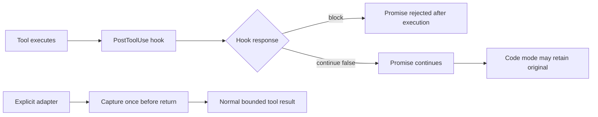

# Hook result boundary and code-mode control flow (2026-09-24)

## Observed limit

An automatic `PostToolUse` receipt is a late intervention: the tool has already run. In Codex code mode, `decision: "block"` rejects the nested JavaScript Promise after those side effects. A sequential script can skip its next step or accidentally retry the command. A controlled read-only reproduction completed the command, archived its final marker, then skipped the statement after `await`. The [official hook contract](https://learn.chatgpt.com/docs/hooks#posttooluse) documents this behavior. This is a correctness problem independent of token savings.

The documented `continue: false` path does not reject the Promise, but it does not guarantee that code-mode JavaScript receives the bounded feedback instead of the original typed result. In an isolated Codex CLI `0.155.0-alpha.16.3` probe with code mode enabled, a temporary `PostToolUse` hook returned `continue: false` and a bounded `stopReason`; the model still reported a random marker present only in the original large output. A `decision: "block"` arm hid the marker. The probe is a counterexample to guaranteed code-mode compaction on that host, not a measurement of all releases. [Upstream issue #36940](https://github.com/openai/codex/issues/36940) identifies `PostToolUseFeedbackOutput::code_mode_result()` returning `original` while the direct response path uses `model_visible`. The issue includes a one-line fix and regression evidence, but is closed as not planned and has no associated PR.

The earlier [PR #20703](https://github.com/openai/codex/pull/20703) implemented a related `updatedToolOutput` path and was closed without merge. [Issue #34895](https://github.com/openai/codex/issues/34895) remains open for non-blocking model-visible replacement. `updatedMCPToolOutput` is [parsed but unsupported](https://learn.chatgpt.com/docs/hooks#posttooluse) in the current contract. These sources already cover the obvious host-side changes; repeating the same upstream patch locally would duplicate work without making an installed plugin version independent. [Issue #31015](https://github.com/openai/codex/issues/31015) separately describes original output reaching a transcript before hook redaction, so a model-input improvement must not be presented as a privacy boundary.

## Chosen boundary

SoL Codex 0.1.9 uses non-blocking `continue: false` feedback to avoid intentionally rejecting a code-mode Promise. Its local `saved_bytes` value is the extracted-text minus receipt length and is not a measured reduction of code-mode model input. For commands that require a guaranteed bounded nested result, the opt-in [explicit command adapter](../measurements/receipt-adapter.md) captures output before the tool returns. Its [three-pair pilot](../measurements/2026-09-24-explicit-adapter-pilot.md) passed all verifiers and reduced aggregate token traffic, but increased aggregate time; it is not yet a default.

## Host capability needed

A future transparent path needs a supported, acknowledged replacement of the nested tool result that preserves the tool's success/failure semantics, exit status, and structured fields. The original should remain in trusted host records but not leak into the next model input or a code-mode script that re-emits it. A hook should detect this capability with a behavioral probe, not a version string, and fall back to the original result when unsupported. The same probe should cover direct and code-mode calls, shell and MCP results, sequential `await`, concurrent calls, long-running `exec_command`/`write_stdin`, unknown status, host truncation, and another hook making a conflicting decision. Acceptance requires one execution, a resolved Promise with the correct status, and no random raw-output marker in the next model input.
