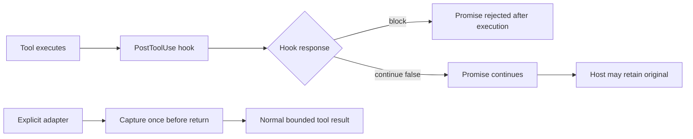

# Hook result boundary and code-mode control flow (2026-09-24)

## Observed limit

An automatic `PostToolUse` receipt is a late intervention: the tool has already run. In Codex code mode, `decision: "block"` rejects the nested JavaScript Promise after those side effects. A sequential script can skip its next step or accidentally retry the command. A controlled read-only reproduction completed the command, archived its final marker, then skipped the statement after `await`. The [official hook contract](https://learn.chatgpt.com/docs/hooks#posttooluse) documents this behavior. This is a correctness problem independent of token savings.

The documented `continue: false` path does not reject the Promise, but it does not guarantee that code-mode JavaScript receives the bounded feedback instead of the original typed result. In an isolated Codex CLI `0.155.0-alpha.16.3` probe with code mode enabled, a temporary `PostToolUse` hook returned `continue: false` and a bounded `stopReason`; the model still reported a random marker present only in the original large output. A `decision: "block"` arm hid the marker. The probe is a counterexample to guaranteed code-mode compaction on that host, not a measurement of all releases. [Upstream issue #36940](https://github.com/openai/codex/issues/36940) identifies `PostToolUseFeedbackOutput::code_mode_result()` returning `original` while the direct response path uses `model_visible`. The issue includes a one-line fix and regression evidence, but is closed as not planned and has no associated PR.

A fresh isolated direct-mode probe on the same CLI explicitly disabled `code_mode`. One `cat` returned 8,033 aggregate bytes. A temporary `PostToolUse` hook ran once, received a 4,118-byte serialized response, and returned `continue: false` with a `stopReason` containing no hidden marker. The model nonetheless reported the random marker from the command output. This is a direct-mode counterexample for this hook response and host, not proof about every hook response, host version, or exact provider prompt bytes. The shorter hook input is consistent with host-side truncation before the plugin sees the result.

A separate boundary probe used `PreToolUse` to replace the same `cat` command **before execution** with a helper that ran it once, archived 8,033 bytes, and printed a 29-byte status receipt. With `code_mode` explicitly disabled and enabled in separate runs, the command exited zero; each archive contained its random marker, while the model answered `UNKNOWN`. This establishes bounded CLI tool results for that simple command in both tested modes; the model answer alone does not reveal the exact next provider request. It does not validate arbitrary shell rewrites, plugin integration, token savings, or repair quality. An initial attempt failed with exit 69 because the selected Python shim required an unaccepted Xcode license; the corrected runs used an available isolated Python runtime.

A later [four-run request-inspection probe](../measurements/2026-09-24-next-request-boundary-development.md) checked the next HTTP model request directly. In both direct and code mode, its direct `cat` control included a random output-only marker in the second request; a temporary PreToolUse helper archived the marker but the second request did not include it. This closes the next-request visibility gap for that simple command and host. It does not establish general safety for automatic rewriting or measure the installed SoL Codex plugin.

A subsequent [verifier-shaped probe](../measurements/2026-09-24-verifier-prehook-boundary-development.md) observed an exact `python -m unittest` command reaching temporary `PreToolUse` as `Bash` in code mode. The child ran once and the output-only marker was absent from the next model request after capture. It still did not exercise the installed plugin, normal permission path, nested JavaScript `await`, or repair quality.

An isolated [packaged-plugin probe](../measurements/2026-09-24-packaged-plugin-request-development.md) then ran the public `0.1.9+codex.20260924` plugin source with a requested `workspace-write` sandbox and hook-trust bypass. Its status wrapper ran and local metrics recorded 6,967 `saved_bytes`; the CLI trace held the raw 8,180-byte result, and its output-only marker still reached the next model request. The control had the same marker visibility. The marker check does not prove transmission of every raw byte. Local packing counters cannot be treated as model-input savings on that host; normal hook trust and approval-capable permission behavior remain unqualified.

An automatic verifier wrapper is **not ready for release**. The current verifier classifier can recognize a command with shell redirection; passing its tokens to the explicit adapter would change semantics. That adapter also closes stdin, combines output channels, starts a new process group, and imposes its own timeout. Its exit code `125` can represent either a child result or an adapter failure; retrying the original after a post-start failure risks a second execution. The pinned loader snapshots `sol_hook.py`, not a separate helper that would survive plugin-cache pruning. A safe opt-in prototype must preserve the existing POSIX `Bash`/`bypassPermissions` gate, skip unsupported commands before launch, bind capture code to the immutable runtime, retain exact status/debt provenance, and fail without replaying the verifier. Windows and approval-capable modes retain the original command. Before any model-input claim, an installed-hook probe must inspect the actual next provider request and cover nonzero status, `errexit`, interruption, concurrency, long-running tools, storage failure, cache pruning, and conflicting hooks.

A separate Astra design review found that `is_verifier()` is not a shell parser: even a redirected verifier can be recognized. Transparent capture cannot inherit the explicit adapter's closed stdin, merged streams, new process group, or timeout without changing some commands. A narrow opt-in profile would need a distinct literal-argv admission check, a pinned capture runtime, and a pre-start failure that does not execute the child. After the child starts, archive failure must not replay it; the result must remain incomplete and verification debt cannot be cleared without trusted status provenance. A host that runs the original command when a required hook fails or conflicts cannot provide an unconditional fail-closed guarantee. The next development target is therefore a **behaviorally qualified subset**, not automatic rewriting of all verifiers.

The earlier [PR #20703](https://github.com/openai/codex/pull/20703) implemented a related `updatedToolOutput` path and was closed without merge. [Issue #34895](https://github.com/openai/codex/issues/34895) remains open for non-blocking model-visible replacement. `updatedMCPToolOutput` is [parsed but unsupported](https://learn.chatgpt.com/docs/hooks#posttooluse) in the current contract. These sources already cover the obvious host-side changes; repeating the same upstream patch locally would duplicate work without making an installed plugin version independent. [Issue #31015](https://github.com/openai/codex/issues/31015) separately describes original output reaching a transcript before hook redaction, so a model-input improvement must not be presented as a privacy boundary.

## Chosen boundary

SoL Codex 0.1.9 uses non-blocking `continue: false` feedback to avoid intentionally rejecting a code-mode Promise. Its local `saved_bytes` value is the extracted-text minus receipt length and is not a measured reduction of model input in either tested mode. For commands that require a guaranteed bounded tool result, the opt-in [explicit command adapter](../measurements/receipt-adapter.md) captures output before the tool returns. Its [three-pair pilot](../measurements/2026-09-24-explicit-adapter-pilot.md) passed all verifiers and reduced aggregate token traffic, but increased aggregate time; it is not yet a default.

## Host capability needed

A future transparent path needs a supported, acknowledged replacement of the nested tool result that preserves the tool's success/failure semantics, exit status, and structured fields. The original should remain in trusted host records but not leak into the next model input or a code-mode script that re-emits it. A hook should detect this capability with a behavioral probe, not a version string, and fall back to the original result when unsupported. The same probe should cover direct and code-mode calls, shell and MCP results, sequential `await`, concurrent calls, long-running `exec_command`/`write_stdin`, unknown status, host truncation, and another hook making a conflicting decision. Acceptance requires one execution, a resolved Promise with the correct status, and no random raw-output marker in the next model input.
