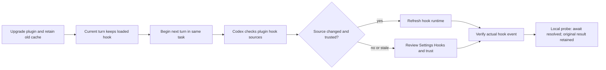

# Hook refresh in an existing task (2026-09-24)

## Observed in this task

After a cache-preserving upgrade from SoL Codex `0.1.8` to `0.1.9`, `codex plugin list --json` reported the new version and both versioned cache paths remained present. A large read-only tool call **within the turn already in progress** still rejected its nested JavaScript Promise with the old `decision: block` receipt. Installation and cache preservation therefore do not by themselves prove that an active turn has adopted the new hook.

On the **next turn of this same task**, a second read-only command produced 9,015 bytes. The statement after `await` executed, the command returned exit code zero, and a private `0600` observation contained all 9,015 bytes. The installed manifest and hook source were `0.1.9+codex.20260924` with non-blocking `continue: false` feedback. No new task or app restart occurred. The JavaScript result still contained the original 9,015 bytes, so this proves control-flow recovery and local archival for this probe, not code-mode context compression.

A second read-only probe printed 9,013 bytes and exited with code `7`. Its `await` also completed, returned `exit_code=7`, and archived the output in a `0600` artifact. A nonzero child exit therefore did not become a rejected code-mode Promise in this observed path; the status remained available to the caller.

## Refresh boundary in the inspected Codex build

In Codex `0.155.0-alpha.16.3` source, [`start_task()` calls `activate_plugin_selection()`](https://github.com/openai/codex/blob/ffa06df2317e3e65fc74da977a5884710c5382d5/codex-rs/core/src/tasks/mod.rs#L285-L291). That function [compares effective plugin hook sources and calls `refresh_hooks()` when they differ](https://github.com/openai/codex/blob/ffa06df2317e3e65fc74da977a5884710c5382d5/codex-rs/core/src/session/plugin_selection.rs#L9-L29). A **new turn in the same task** was the successful refresh boundary in the local probe. Other host builds and trust states still require a real hook event for verification.

If another host still invokes the old hook on the next turn, review the resolved definition and trust in **Settings → Hooks**. In the inspected app-server source, a config batch write with `reloadUserConfig: true` [reloads user configuration](https://github.com/openai/codex/blob/ffa06df2317e3e65fc74da977a5884710c5382d5/codex-rs/app-server/src/request_processors/config_processor.rs#L157-L178) and [refreshes hook runtimes in loaded sessions](https://github.com/openai/codex/blob/ffa06df2317e3e65fc74da977a5884710c5382d5/codex-rs/core/src/session/mod.rs#L2104-L2129). A list-only **Reload hooks** action does not itself demonstrate that the active runtime changed. Verify an actual subsequent event before treating the upgrade as active. The [official plugin guide](https://developers.openai.com/plugins/build/plugins) recommends an app restart for local marketplace file changes; this note records a successful narrower CLI upgrade and same-task refresh on one inspected build.

## Version-independent design constraint

The existing bootstrap pins a reviewed runtime digest to the task and lexical `PLUGIN_ROOT`. That is why a pruned old cache can be recovered, and why overwriting an old cache path must not be used as a hot-update shortcut. A future stable dispatcher could activate a new immutable runtime snapshot at an explicit trust boundary, keep old snapshots for active calls, and bind each Pre/Post pair to one generation. Such a dispatcher would require a reviewed protocol and tests for races, disabled hooks, and trust changes. The current bootstrap does not implement that design. A new turn plus a verified host refresh is the practical path for this release.
