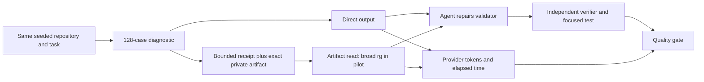

# Retrieval economics after bounded tool output (2026-09-24)

This note extends the [context-efficiency map](2026-09-23-context-efficiency.md) and the [real-repository receipt pilot](../measurements/2026-09-24-real-repo-pilot.md). It distinguishes the size of a saved observation from what the agent actually sees, what it spends recovering evidence, and whether it completes the task. Published results below belong to their authors' settings; they are not SoL Codex results.

## New evidence and what it changes

| Primary source | Reported evidence and limits | Testable implication here |
| --- | --- | --- |
| [TRACE, August 2026](https://arxiv.org/html/2608.06503v1) | On 168 AppWorld tasks with two runs per task, its optimized compression prompt achieved 77.1% average accuracy versus 71.4% for a compressed prompt baseline; no compression reached 85.7%. The paper evaluates paired continuations from the same state at a compression boundary. This is an API-agent preprint, not a coding-agent receipt result. | Compare the next decisions after a receipt boundary and count repeated or blocked actions as well as final correctness. A smaller summary can lose execution state even when facts remain recoverable. |
| [Measure Before You Manage, August 2026](https://arxiv.org/html/2608.31057) | Its 55 archived coding trajectories show different size and residency patterns for tool outputs and source artifacts. An object-aware policy's calibration improvement in repeated calls did not survive multiple-comparison correction on eight held-out tasks. Its retrieval follow-up lacks a valid formal repair-success score and incurred auxiliary work. | Report stored state, delivered context, management work, and task outcome separately. Treat any tuned task as development data, not confirmation. |
| [ACM, July 2026](https://arxiv.org/html/2607.23809v1) | A trained 9B agent with explicit offload/retrieve tools improved SWE-bench Verified pass@1 from 0.489 (ReAct) to 0.530, while average tool calls rose from 74.7 to 79.3. Its method uses additional model training and model-based summarization/querying; the 50K peak-token figure is not total token cost. | Exact external evidence and agent-chosen retrieval are promising, but retrieval calls and service costs must be counted. Current SoL Codex cannot edit earlier context through its hook. |
| [ContextBench, February 2026](https://arxiv.org/abs/2602.05892) | 1,136 issue tasks across 66 repositories have human-annotated gold context. The paper reports that agents often retrieve more context than they use and tend toward recall over precision. Gold-context retrieval is a process measure, not sufficient proof of a correct repair. | Track whether the decisive diagnostic line was seen, whether it was used, and whether an independent verifier passed. |
| [Paritok-4B, August 2026](https://arxiv.org/html/2608.24188v1) | On 300 single-shot SWE-bench Lite instances with oracle source files, the line-numbered setting retained 27.8% of context and 89.3% of baseline solve rate (109 versus 122 resolved). There is no agent loop or rereading; 16 compressed-arm patches failed to apply versus five baseline patches. A non-significant paired test does not establish equivalent quality. | Do not deploy a model compressor from its compression ratio. Preserve exact spans and measure patch application plus full repair success in a multi-turn agent. |
| [Anthropic dynamic filtering, February 2026](https://claude.com/blog/improved-web-search-with-dynamic-filtering) | Filtering web results before context improved two search benchmarks and used 24% fewer input tokens on average. Anthropic reports price-weighted token cost fell for Sonnet 4.6 but rose for Opus 4.6. These are web-search results. | The pre-return boundary is practical, but input-token reduction alone is not a cost claim. |

[Memora](https://arxiv.org/html/2602.03315v2) suggests concise retrieval cues backed by richer records, but evaluates conversational memory, not code repairs. [Google TurboQuant](https://research.google/blog/turboquant-redefining-ai-efficiency-with-extreme-compression/) compresses inference-side KV representations and is outside a local command adapter's control. Neither is evidence that preserving local artifacts restores provider prompt/KV cache.

## Local causal question

Our earlier real-repository pilot did not require either agent to reopen a saved observation. The new question is: **when a decisive line falls outside a bounded receipt, can the agent recover it precisely and still finish with lower total work?** The treatment is the opt-in [pre-return command adapter](../measurements/receipt-adapter.md), not the installed `PostToolUse` hook.

The exploratory pair uses the public v0.1.9 repository with a seeded ZIP member-type defect. A controlled 128-line diagnostic contains exactly one mismatch at case 064, in the middle, without an error keyword; its first and last two lines do not reveal the mismatch. OFF sees the raw diagnostic. ON uses the frozen adapter (SHA-256 `067ee9df409b84f52da3646df69c693253d9de2e46c8d9da0ed9df3507f80f1d`) and can search its private artifact. Both are told to identify the mismatching case before editing the validator. Each arm gets its own Git-backed working copy and ephemeral Codex session; raw traces and artifacts stay outside the repository. The model is `gpt-6-luna` at low effort in code mode with hooks and other plugins disabled. ON includes adapter-specific instructions and a longer absolute command path, so the prompts are not byte-identical.

Before either model run, an independent verifier confirms that the seeded defect fails its intended condition. After each run, that verifier and the focused public symlink-member test check the repair. The preflight originally invoked the entire release-tool suite and timed out at 60 seconds; this harness error was corrected before any model run and is excluded. The public suite was narrowed to the relevant test so its cost would not dominate the feasibility check.

## Exploratory result

The [aggregate-only JSON report](../measurements/data/2026-09-24-retrieval-pilot.json) records one complete OFF → ON pair. Both agents identified case 064, repaired the validator, and passed the independent verifier and focused public test. Raw JSONL traces, the captured observation, and per-arm working copies remain private. The artifact contained 13,055 bytes and was saved outside both repositories; the ON agent reopened it twice.

| Measure | Direct OFF | Receipt ON |
| --- | ---: | ---: |
| First diagnostic result delivered to the agent | 13,055 bytes | 1,074 bytes |
| All command result text across the task | 34,882 bytes | 52,564 bytes |
| Provider input + output tokens | 265,092 | 332,812 (+25.5%) |
| Cached / uncached input tokens | 243,456 / 20,504 | 305,664 / 25,611 |
| Elapsed model-task time | 159.43 s | 181.36 s (+13.8%) |
| Recorded tool calls / artifact reads | 9 / 0 | 12 / 2 |
| Independent and focused public verification | pass / pass | pass / pass |

The first ON receipt omitted the decisive line, as designed. The agent searched the exact artifact twice, but both expressions included field names present on every line. Each search returned 13,459 bytes, so the two reads alone delivered 26,918 bytes after the 1,074-byte receipt. OFF also reran and filtered the diagnostic rather than relying only on its original 13,055-byte result; exact-command repetition was zero because the commands differed. ON additionally tried an incorrect test-class name before finding the focused test. OFF ran two broader test commands that failed for reasons outside the hidden condition. These trajectories differ, so the 25.5% token difference is **not** an isolated causal estimate of receipt overhead. It is direct evidence that an unbounded artifact query can erase the first-result byte saving while the task still passes.

This pair falsifies the narrow operational assumption that an exact artifact handle plus an instruction to search it will reliably produce a small retrieval. It does not show that bounded receipts are generally slower or that the adapter harms task quality. The provider-reported cached tokens are not proof of lower billed cost or preserved provider cache. The result does not change the released plugin or justify enabling the adapter by default.

## Next experiment

The first **bounded retrieval prototype** is now [implemented separately](../measurements/receipt-adapter.md#bounded-artifact-search). It uses literal matching, reports total match count, emits at most four lines and 2,048 JSON bytes, marks truncation, and verifies the exact artifact SHA-256. Against the frozen 13,055-byte diagnostic, a broad field-name query found 128 matches but returned 682 bytes; the selective `expected_type_rejection=True` query returned 315 bytes and exposed case 064. A later [one-pair development run](../measurements/2026-09-24-bounded-search-development.md) showed that an agent could use this interface and finish with fewer provider tokens on the already used fixture. It is not held-out confirmation. The current search tool also supports bounded line-range recovery and explicit omission reporting.

Separately compare a same-size deterministic evidence-first receipt that selects lines relevant to the current task; do not let it silently replace exact artifacts.

For task-level confirmation, freeze the direct, current-receipt, and bounded-retrieval treatments before held-out runs. Use multiple task families and balanced repetitions, including misleading matches and evidence outside every preview. Report paired completion, exact evidence retrieval, provider input/cached/output tokens, time, repeated commands, and every timeout or invalid run. The [cost-frontier protocol](2026-09-24-cost-frontier.md) spells out the stronger quality and efficiency gate. A receipt mode should become a default only after quality holds and total cost or time improves on held-out tasks.
