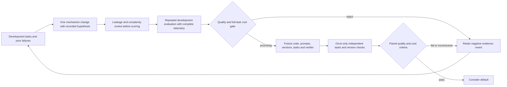

# RRSI and a generalization gate for SoL Codex (2026-09-24)

## What the paper measured

[RRSI: Regularized Recursive Self-Improvement of Agent Harnesses](https://arxiv.org/html/2609.24972) evolves prompts, control flow, tools, memory and context management around a frozen model. It constrains proposal size, remembers failed hypotheses and explores unused components. A selector screens benchmark-specific edits before evaluation, applies a noise-adjusted score floor and a token-growth rule, and prunes unproductive structure. The authors' [public implementation](https://github.com/google-research/rrsi) contains these mechanisms. This is harness evolution, not a measured effect of a Codex `PostToolUse` hook.

The key risk for our work is **adaptive overfitting**: repeated choices informed by scores on the same finite task set can improve that set without improving unseen tasks. In the paper's [workspace ablation](https://arxiv.org/html/2609.24972#S4.T2), unregularized evolution scores 92.8 on the evolve set and 40.3 on an out-of-distribution average; RRSI scores a lower 90.5 on evolve and a higher 43.6 out of distribution. The unevolved harness scores 89.4 and 39.7. Our repeated 128-case, one-middle-mismatch development pairs are likewise one exposed family, regardless of defect variant. This is a methodological analogy, not evidence that RRSI's performance transfers to SoL Codex.

The [coding results](https://arxiv.org/html/2609.24972#S4.T3) report Terminal-Bench 2.1 evolve gains of 6.0 points with Claude Opus 4.8 and 14.1 with Gemini 3.5 Flash; unchanged harnesses gain 1.8 and 2.2 points respectively on SWE-bench Verified. In a [cross-model check](https://arxiv.org/html/2609.24972#S4.T4), a Gemini-evolved harness raises Gemini 3.1 Flash Lite's Terminal-Bench score from 11.2 to 14.6. These are reported point estimates. The paper does not give a paired uncertainty interval for the 1.8-point SWE-bench difference or establish effectiveness across Codex host versions.

## Cost arithmetic and audit boundary

RRSI uses 2.42 million policy tokens per workspace trial against 3.80 million for unregularized evolution: **36.3% fewer** from the rounded ablation values. The unevolved harness uses 1.56 million: RRSI uses **55.1% more** than that baseline while raising the out-of-distribution average from 39.7 to 43.6. The abstract's “30% fewer” compares evolved harnesses, not the original harness. Policy tokens are not a provider bill; input/output prices, cache tiers and proposal/evaluation search spend are separate. For `N` future tasks, compare `search_cost + N × task_cost` with the frozen baseline. A candidate with higher task cost cannot repay search expense through token savings alone.

At public code revision [`be50316`](https://github.com/google-research/rrsi/tree/be50316e1db05914068a973f322770ef08ed7ba1), [`aggregate` and `relative_cost_change`](https://github.com/google-research/rrsi/blob/be50316e1db05914068a973f322770ef08ed7ba1/rrsi/evaluate.py) give missing trials zero reward but average token cost only over present positive counts, and return zero cost change if either arm has no token count. A local two-trial check with one missing token record yielded reward 0.5 and cost 1,000 from the sole reported trial; a wholly missing arm yielded zero cost change. This is a **conditional telemetry risk**, not evidence that published runs lacked token data. The repository has method code and test scripts but no raw benchmark-run ledger at that revision. Reproducing its headline results requires external benchmarks, provider access and substantial inference. The authors [note](https://arxiv.org/html/2609.24972#S6) sensitivity to the evolve set, feedback quality and hyperparameters.

An independent code review found further limits, then we reproduced the relevant pure-function behavior locally:

| Check | Observation | Implication for our gate |
| --- | --- | --- |
| [`schedule.py`](https://github.com/google-research/rrsi/blob/be50316e1db05914068a973f322770ef08ed7ba1/rrsi/schedule.py), coding `T=20`, `b_min=1`, `b_max=4` | The 20 executed rounds have edit budgets 4 (eight rounds), 3 (five), then 2 (seven). A budget of one is reached only at `t=T`, outside the run. | The stated late single-edit attribution is not guaranteed by this configuration; explicitly test schedule endpoints before borrowing it. |
| [`selection.py`](https://github.com/google-research/rrsi/blob/be50316e1db05914068a973f322770ef08ed7ba1/rrsi/selection.py), coding parameters | A synthetic incumbent at 132/178 and candidate at 129/178 with a first `memory` edit and 2% higher token cost is **admissible**: the score loss is within `delta=0.017`, and novelty outweighs the cost term. | The paper's selector is designed to explore; it is not our quality-noninferiority or economy acceptance test. |
| [`coding/adapter.py`](https://github.com/google-research/rrsi/blob/be50316e1db05914068a973f322770ef08ed7ba1/domains/coding/adapter.py) | `_tokens` returns no usage whenever a result has `exception_info`, including timeout types that are not classified as infrastructure failures. | A failed/partial trial's prior model spend can be absent from the token-cost average; our campaign must account for it externally or mark cost inconclusive. |

The [GDPval evaluation description](https://arxiv.org/html/2609.24972#A1.SS5) also says 185 tasks, two presentation orders, and 204 comparisons per judge per harness. Those counts do not reconcile without an unreported task subset; a run manifest would be needed to resolve the denominator. This does not invalidate the other benchmark results by itself.

## Transfer to the SoL research loop

The initial proposal ledger consolidates existing results; each row is **development evidence** and remains available as negative or mixed evidence for later proposals:

| Mechanism / exposed family | Observed result | Current verdict |
| --- | --- | --- |
| [Explicit adapter on a short test result](../measurements/2026-09-24-real-repo-pilot.md) | Both repairs passed; ON used 64,699 vs OFF 62,061 provider tokens and took longer. | Do not wrap short output by default. |
| [Unbounded artifact search on the 128-case ZIP diagnostic](2026-09-24-retrieval-economics.md) | Both passed; broad queries replayed the saved diagnostic twice and ON used 332,812 vs OFF 265,092 tokens. | Reject unbounded retrieval as an economy mechanism. |
| [Bounded search on the previously exposed ZIP diagnostic](../measurements/2026-09-24-bounded-search-development.md) | Both passed; ON used 147,203 vs OFF 212,475 tokens. | Promising implementation check, not independent confirmation. |
| [Bounded search on the cache-boundary defect](../measurements/2026-09-24-cache-boundary-development.md) | Both passed; ON used 10.3% fewer tokens but took 19.7% longer. | Mixed frontier; count as the same 128-case diagnostic family. |
| [Bounded search on a historical CRLF defect](../measurements/2026-09-24-historical-crlf-development.md) | Both failed the complete behavior matrix; ON used 31.8% more tokens. | Rejected as an accepted repair; retain the verifier failure. |
| [Natural Click and packaging repairs](../measurements/2026-09-24-natural-history-development.md) | Both pairs passed external checks, but ON never invoked the adapter and used 539,138 vs OFF 387,939 tokens. | Instruction-adherence failure; no compression-effect estimate. |
| [Natural SQLGlot traceback repairs](../measurements/2026-09-24-natural-history-development.md) | First ON passed 9/9 but OFF timed out without usage. In a second fully metered series, OFF passed 13/13 while ON stopped without a patch. | Reject an efficiency claim: incomplete cost evidence in the first series, quality failure in the second. |
| [Natural SymPy ArraySymbol repair](../measurements/2026-09-24-natural-history-development.md#sympy-arraysymbol-apparent-token-reduction-post-hoc-regression) | Both arms passed 35 frozen external and 48 selected upstream checks; ON used 418,639 versus OFF 613,638 CLI-reported tokens. A later compatibility check scored both repairs 0/2 against parent/gold 2/2, but its [API requirement is unestablished](../measurements/2026-09-24-sympy-contract-reassessment.md). | Acceptance unresolved; retain the token observation and measured behavior change without claiming a quality failure or saving. |

The ledger prevents a later candidate from presenting the ZIP, cache and CRLF diagnostics as three independent confirmations. The complete source measurements remain in the linked notes.

1. Keep a proposal ledger with component, falsifiable hypothesis, source diff, exposed task family, quality matrix, total provider input/output tokens, cached/uncached split, time and verdict. Keep rejected hypotheses visible. Do not assign independent credit to several edits bundled in one run.
2. Screen before evaluation for fixture names, hard-coded task values, future fixes and benchmark-specific branching. A reviewer can catch obvious leakage; only inaccessible held-out tasks measure generalization. Keep gold, hidden checks and the other arm outside the agent's filesystem and network view.
3. For an economy claim, require **quality noninferiority and lower full-task cost per accepted repair**. Count failures, retrieval, summarization, extra model calls and amortized search. Missing telemetry cannot be imputed as zero or pass a cost gate. Do not grant a novelty bonus that can compensate for a measured quality loss. A quality-improving, more expensive harness belongs on a separately reported frontier.
4. Freeze the candidate and analysis before independent tasks. Once their outcomes guide another edit, move that set to development and select a new untouched confirmation set. Test a frozen mechanism across actual Codex host versions; the paper's backbone swap is not a host-compatibility test.
5. Test the gate itself: with the same development budget, compare a score-only selector `S0` to an `S1` selector with recorded leakage, quality and cost gates. On once-only held-out tasks, compare accepted repairs, all-attempt tokens per accepted repair, time and selection mistakes. The hypothesis fails if `S1` rejects useful general mechanisms or its search overhead exceeds subsequent savings.

The Click and packaging parent→fixed matrices were independently rerun as 3/9→9/9 and 8/14→14/14 before their [ON/OFF development pairs](../measurements/2026-09-24-natural-history-development.md). Their parent/fix revisions are [Click #2447](https://github.com/pallets/click/issues/2447) `16fe802a3f96c4c8fa3cd382f1a7577fda0c5321` → `36deba8a95a2585de1a2aa4475b7f054f52830ac` and [packaging #928](https://github.com/pypa/packaging/issues/928) `3f83dea9b60e660e464535a1019d2de62723884f` → `a1f705642e50b79da6be83fb0f6149daa32fc7cc`. Both ON agents ignored the adapter rule. These are exposed development probes, not enough for the [confirmation protocol](2026-09-24-cost-frontier.md)'s quality and precision gates.
