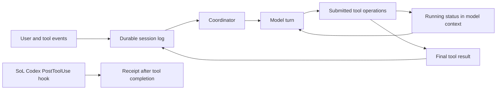

# Unreal Agent benchmark and harness review (2026-09-24)

## What the public evidence supports

[Unreal Labs reports](https://unreallabs.ai/blog/unreal-agent/) a Terminal-Bench 4.0 run with GPT-6 Astra at `xhigh`: Unreal Agent scored 57.9% at a reported total inference cost of $1,428, against a Codex *leaderboard* result of 57.9% and $2,350. The stated difference is `(2350 - 1428) / 2350 = 39.23%`. This verifies the arithmetic of the **reported comparison**, not a 39% causal saving from changing the harness or a proof of equivalent task-level quality.

The linked [Harbor job](https://hub.harborframework.com/jobs/27133053-2015-46f3-8c72-6b6910859da6) publicly shows 330 finished trials, 329 completed and one error, an average reward rounded to 0.58, 608,400,409 total tokens, and a 96% cache-hit indicator. Its Config tab identifies `openai/gpt-6-astra`, `thinking_level: xhigh`, a dataset hash, five attempts and a Modal environment. On 2026-09-24, counting the reward cells across all four pages of its [Trials tab](https://hub.harborframework.com/jobs/27133053-2015-46f3-8c72-6b6910859da6?tab=results) gave **192 successes in 330 trials = 58.18%**, one more success than the blog's 57.9% implies. The cause is unknown; a dated snapshot is needed before treating either figure as the exact score of this job. Harbor displays **no per-trial inference cost** for this job; its page therefore does not independently audit the blog's $1,428. The Codex baseline is a separately published leaderboard result, with no linked Codex trial logs in the article. The [official leaderboard filtered to `xhigh`](https://www.tbench.ai/?filters=%7B%22sets%22%3A%7B%22reasoning_effort%22%3A%5B%22xhigh%22%5D%7D%7D) shows Codex/Astra at 57.9% ± 2.7 percentage points, 1.2B tokens and $2.4k rounded, consistent with the blog's $2,350. Its default view instead shows the Astra `max` entry at a higher cost.

Five attempts across 330 trials match the [66-task dataset](https://hub.harborframework.com/datasets/terminal-bench). Attempts on one task are correlated, so 330 is not the number of independent task types. Even the blog's identical rounded aggregate pass rates would not establish paired equality, a quality noninferiority margin, or comparable failure handling. The runs also occurred on different dates. A matched, same-date rerun would need the same task IDs, dataset and verifier versions, effort, model snapshot, timeouts, prompt policy, cache/pricing rules, and per-trial outcomes and usage. Errors and missing usage must remain in the denominator and cost accounting.

The public [repository](https://github.com/unreallabsai/unreal-agent) is MIT licensed and contains a Go harness, runner and [Harbor adapter](https://github.com/unreallabsai/unreal-agent/tree/main/benchmarks/harbor). The Config tab's bundled runner path ends in `75748cc`; that prefix was not present in the repository's public history when checked on 2026-09-24. Treat the published source as architecture evidence, not an exact source-level reproduction of this run.

Independent context: the [Arena HarnessTax study](https://arena.ai/blog/coding-agents-harness-tax) compared 21 model–harness combinations on 30 sampled tasks from each of two older benchmarks, with three attempts per task and a fixed API price list. It found that harness choice could change modeled cost substantially while mean success stayed close in its settings. Its small task sample, older benchmarks and different harnesses support testing the hypothesis; they do not validate Unreal Agent's particular percentage or SoL Codex.

## Mechanism and boundary

The [blog](https://unreallabs.ai/blog/unreal-agent/) attributes efficiency to smaller prompts/results and more useful tool work per model turn. It describes an asynchronous tool result that first says an operation is running, followed by the final result when it arrives. The current public [coordinator](https://github.com/unreallabsai/unreal-agent/blob/main/harness/coordinator/loop.go) schedules operations and reacts to inbox and completion events; the [context builder](https://github.com/unreallabsai/unreal-agent/blob/main/harness/contextbuilder/builder.go) stages running and final results while preserving a committed prefix. It removes a running placeholder only if that placeholder is still uncommitted; an already committed one remains part of history. The [session store](https://github.com/unreallabsai/unreal-agent/tree/main/harness/sessionstore) provides durable history and recovery. These are observable design choices, while the size of each choice's contribution to the reported saving remains unmeasured publicly.

This is a different intervention from SoL Codex's receipt hook. A `PostToolUse` hook sees a completed tool event; it does not own the model-turn scheduler, tool lifecycle, or provider prompt cache. SoL Codex cannot reproduce asynchronous scheduling or durable agent-turn recovery by changing receipt text. A durable session log could support process recovery without asking a user to start a new chat, but does not preserve the provider's KV cache or refresh installed hooks on its own. An external, version-independent runner could implement those ideas, but would be a separate product path with its own security, UX, compatibility, and evaluation requirements. Our explicit receipt adapter can still borrow the narrower principle of a stable, small tool-result schema; it must be measured independently.

## Next experiment

First isolate the mechanism *within one harness*: freeze one Unreal Agent revision and make a serial-tool mode that uses the same prompts, tools, model and result format but waits for tool completion before the next model turn. On paired, independently verified tasks, compare accepted repairs, full provider-billed token categories, cost, cache reads/writes, turns, tool calls, latency and errors. Then compare the winning mode with Codex on the same trials. This distinguishes asynchronous scheduling from minimal prompts and output formatting. It also avoids treating a leaderboard aggregate as a randomized A/B result. Without the benchmark's exact runner revision, a fresh experiment must pin a public revision rather than claim to reproduce the published job.

For SoL Codex, keep the existing receipt confirmation campaign separate. Its installed hook should not claim Unreal Agent's 39% result or present it as evidence of lower billed cost from receipt compression.
